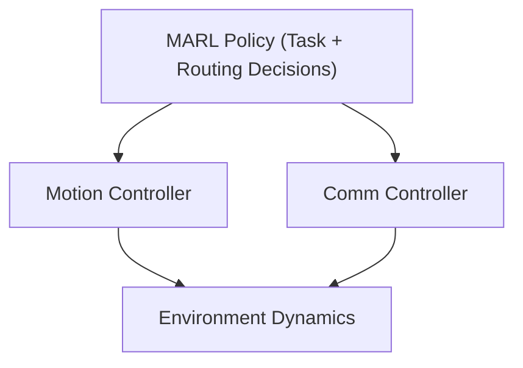

# Case Study 2: Collaborative Task Allocation and Network Adaptivity

## Objective (Tight Claim)
Under dynamic task arrivals and constrained communication/energy, a CTDE-trained swarm learns a joint policy that:
- reallocates tasks online, and
- routes data opportunistically via relays,
yielding higher task completion, higher throughput, and lower AoI than static plans.

## Environment Summary
- Agents: 6 UAVs with battery, motion limits, comm range, data buffer.
- Tasks: 10 total, dynamic arrivals (some at t=0, others mid-mission).
- Constraints: energy cost (move/sense/tx), bandwidth limit, range-limited comm, base coverage.

## AoI Definition (Persistent Streams)
Each task is a persistent sensing stream once active. At the base:
- For task stream i, AoI is defined as:
  AoI_i(t) = t - u_i(t), where u_i(t) is the generation time of the latest update received.
- We report time-average AoI over active tasks across the episode, and p95 AoI.

If tasks were one-shot, this would be renamed to Information Delay instead of AoI.

## CTDE Assumption (Clarified)
- Centralized critic is used **only during training**.
- Execution uses **local observations only**.
- No extra communication overhead is assumed at test time.

## Reward Shaping (Clarified)
- Reward is a scalar team reward (global), computed centrally.
- Agents do **not** observe global AoI/throughput as state.
- This is standard for cooperative MARL and does not leak state information.

## Agentic Layer (Decision vs Execution)
The MARL policy makes **high-level decisions**:
- Task choice (allocation/reallocation).
- Relay choice (routing).

Low-level controllers handle motion/comm execution (abstracted).



## Ablations (Mandatory)
We separate task allocation and routing to avoid conflating effects:
- `mappo_task_only`: learned task + motion, fixed routing.
- `mappo_routing_only`: fixed task assignment, learned routing.
- `mappo_full`: learned task + routing.

## Baselines (Non-Learning)
- `static`: static task allocation + direct-to-base routing.
- `fixed_relay`: static allocation + fixed relay tree.
- `greedy`: energy-aware greedy allocation + opportunistic relay heuristic.

## Metrics
- Task completion rate (%).
- Throughput (bps to base).
- AoI: time-average + p95 over active tasks.

## Robustness & Generalization (Stress Tests)
We sweep:
- energy budget (±20%),
- bandwidth (50%),
- dynamic task count,
- map size,
- comm range.

Outputs are logged in `outputs/logs/stress_tests.jsonl`.

## Credibility Guardrail (Important)
For publication-facing claims, use a standard MARL library pipeline:
- `Ray RLlib` for CTDE PPO/MAPPO-style training.
- `PettingZoo` parallel environment wrapper for multi-agent API compliance.

The custom trainer in `training/train_mappo.py` is kept for fast experiments, but should not be the primary evidence source in a publication submission.

## How To Run (Library-First)
Train PPO-CTDE with RLlib:
```bash
PYTHONPATH=/Users/nitin/Desktop python training/train_rllib_ppo_ctde.py --env-config /Users/nitin/Desktop/case_study_2/configs/env.yaml --stop-iters 100
```

Evaluate RLlib checkpoint:
```bash
PYTHONPATH=/Users/nitin/Desktop python evaluation/eval_rllib_ppo_ctde.py --env-config /Users/nitin/Desktop/case_study_2/configs/env.yaml --checkpoint <RLLIB_CHECKPOINT_PATH> --seed 1
```

## How To Run (Experimental Custom Trainer)
Train custom MAPPO (full / task-only / routing-only):
```bash
PYTHONPATH=/Users/nitin/Desktop python training/train_mappo.py --mode full --ckpt-name mappo.pt
PYTHONPATH=/Users/nitin/Desktop python training/train_mappo.py --mode task_only --ckpt-name mappo_task_only.pt
PYTHONPATH=/Users/nitin/Desktop python training/train_mappo.py --mode routing_only --ckpt-name mappo_routing_only.pt
```

Evaluate:
```bash
PYTHONPATH=/Users/nitin/Desktop python evaluation/eval_runner.py --method static
PYTHONPATH=/Users/nitin/Desktop python evaluation/eval_runner.py --method fixed_relay
PYTHONPATH=/Users/nitin/Desktop python evaluation/eval_runner.py --method greedy
PYTHONPATH=/Users/nitin/Desktop python evaluation/eval_runner.py --method mappo_full
PYTHONPATH=/Users/nitin/Desktop python evaluation/eval_runner.py --method mappo_task_only
PYTHONPATH=/Users/nitin/Desktop python evaluation/eval_runner.py --method mappo_routing_only
```

Plot results:
```bash
PYTHONPATH=/Users/nitin/Desktop python analysis/plots.py
```

Stress tests:
```bash
PYTHONPATH=/Users/nitin/Desktop python evaluation/stress_tests.py
```
